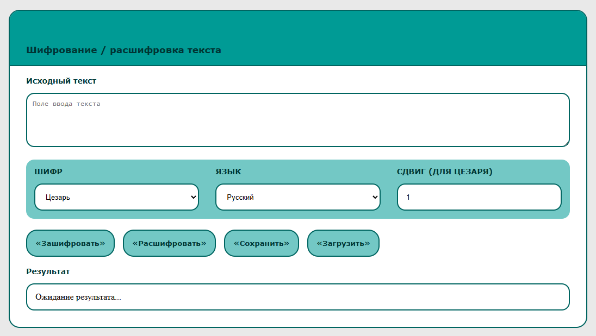

# Text_message_encryption
## Деплой: https://m0rdwinix.github.io/Text_message_encryption/


## 🛠️ Технологии

| Технология | Назначение |
|------------|------------|
| HTML5 | Структура страницы |
| CSS3 | Стилизация и адаптив |
| JavaScript (ES6+) | Логика приложения |
| GitHub Pages | Деплой |

## 📦 Установка и запуск

```bash
# Клонировать репозиторий
git clone git@github.com:M0rdWinix/Text_message_encryption.git

# Перейти в папку проекта
cd Text_message_encryption

# Установить зависимости
npm install

# Запустить в режиме разработки
npm run dev
